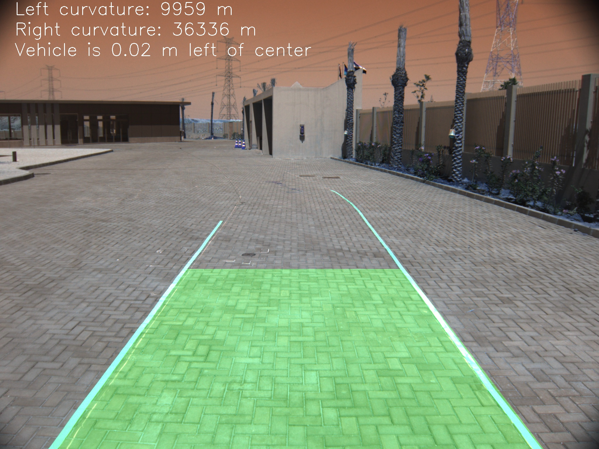

# Advanced Lane Detection using computer vision
Drivable area detection can be considered as the most important module in any self driving car. This module gives the car the ability to detect any drivable region and also allows the car to make decision as steering , accelerating or changing the lane. In this repo you can find an advanced way for detecting the lanes and measuring the curvature for each lane.

## Getting Started
These instructions will get you a copy of the project up and running on your local machine for development and testing purposes.
## Prerequisites
This pjorect was built by using ubhuntu 18 , pyhton3 and openCV
### Installing 
1. You need to install git on your local machine using this command 
`sudo apt install git`
2. Clone the repo :
`git clone https://github.com/MohamedAdelNaguib/AdvancedLaneDetection.git`
3. Install openCV
## Running the tests
1. you need to calibrate your camera by replacing the images in camera_cal with your images of chess board (30 to 40 images from different angels and distances).
2. * Set the suitable thresholds in 2-Color_Transform_and_Gradients_Threshold.py
   * Set offsets of prespective transformation in 3-Apply_Perspective_transformation.py
3. run laneDetection.py on you test images

 Note : To run any file just wirte in you command line window **python3 file.py**
### Authors 
**Mohamed Adel Naguib**
### Acknowledgments
* I want to thank everyone who supported me and believed in my abilities to make this project.
